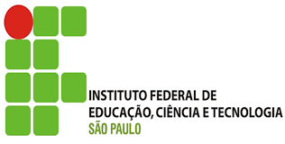
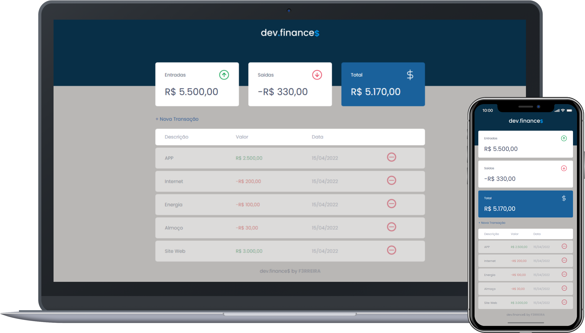

<h1 align="center">
  
</h1>

  <a href="#-ifsp">IFSP</a>&nbsp;&nbsp;&nbsp;|&nbsp;&nbsp;&nbsp;
  <a href="#-curso">Curso</a>&nbsp;&nbsp;&nbsp;|&nbsp;&nbsp;&nbsp;
  <a href="#-disciplina">Disciplina</a>&nbsp;&nbsp;&nbsp;|&nbsp;&nbsp;&nbsp;
  <a href="#-projetos">Projetos</a>&nbsp;&nbsp;&nbsp;|&nbsp;&nbsp;&nbsp;
  <a href="#-tecnologias">Tecnologias</a>&nbsp;&nbsp;&nbsp;|&nbsp;&nbsp;&nbsp;
  <a href="#earth_americas-publicações">Publicações</a>&nbsp;&nbsp;&nbsp;
 

 

  

## 🏫 IFSP

O Instituto Federal de Educação, Ciência e Tecnologia de São Paulo – IFSP – é uma autarquia federal de ensino.

Fundada em 1909, como Escola de Aprendizes Artífices, é reconhecida pela sociedade paulista por sua excelência no ensino público gratuito de qualidade.

Durante sua história, recebeu, também, os nomes de Escola Técnica Federal de São Paulo - ETFSP e Centro Federal de Educação Tecnológica de São Paulo - CEFET. 

Com a transformação em Instituto, em dezembro de 2008, passou a ter relevância de universidade, destacando-se pela autonomia. Acesse o portal do [IFSP](https://ifsp.edu.br/) para mais informações.

## 👨‍💻 Curso

O Curso Superior de Tecnologia em Análise e Desenvolvimento de Sistemas (TADS) do Câmpus São Paulo tem como objetivo capacitar o egresso a atuar na área de Tecnologia de Informação e Comunição (TIC) em atividades como análise, projeto, implementação, gerenciamento e implantação de sistemas de informação. Esta capacitação é pautada pela valorização da autonomia do estudante, prática em competências técnicas, e atualização diante da realidade tecnológica, de modo que o profissional seja um mediador competente entre o desenvolvimento tecnológico e a sociedade em que se insere.

## 🎒 Disciplina

A disciplina Desenvolvimento WEB II aprofunda os conhecimentos acerca do desenvolvimento de aplicações web do lado cliente. Nela é aprofundada a linguagem JavaScript, apresentando as principais características e técnicas de desenvolvimento, permitindo o desenvolvimento de aplicações de fácil manutenção, eficientes, eficazes e organizadas.

## 💻 Projetos

Para acessar os repositórios com códigos fonte dos projetos, basta clicar no link correspondente:

- [dev.finace$](https://github.com/F3RREIRA/DW2A4/tree/main/Atividades/A4)
- [Form.dev](https://github.com/F3RREIRA/DW2A4/tree/main/Atividades/A5)
- [Pesquisa.Covid](https://github.com/F3RREIRA/DW2A4/tree/main/Atividades/A6)

## 🚀 Tecnologias

Os projetos foram desenvolvidos utilizando as seguintes tecnologias:

- HTML
- CSS
- JavaScript

## :earth_americas: Publicações

Para acessar e testar as funcionalidades das páginas criadas, basta clicar no link correspondente:

- [dev.finace$](https://f3rreira.github.io/DW2A4/Atividades/A4/)
- [Form.dev](https://f3rreira.github.io/DW2A4/Atividades/A5)
- [Pesquisa.Covid](https://f3rreira.github.io/DW2A4/Atividades/A6)
---
by [F3ERREIRA](https://github.com/F3RREIRA)
